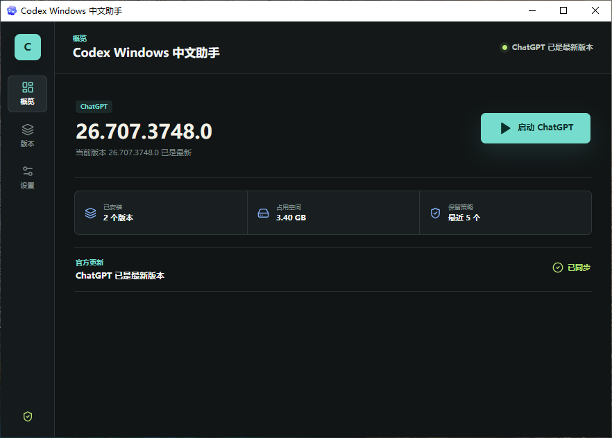
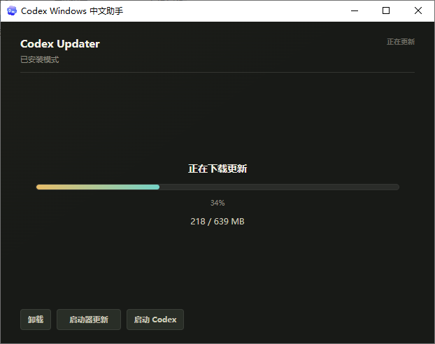
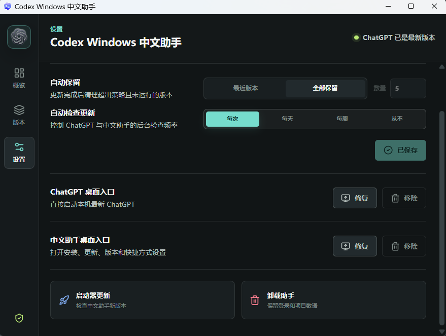

# Codex Windows 中文助手

[](https://github.com/chrichuang218/codex-windows-cn/releases/latest)
[](https://github.com/chrichuang218/codex-windows-cn/actions/workflows/ci.yml)
[](LICENSE)
[](https://www.microsoft.com/windows)

面向中文 Windows 用户的 **中文安装更新助手**，用于安装、启动和维护官方 Microsoft Store 桌面应用，并在本机管理保留下来的 Codex / ChatGPT 历史版本。

默认启动最新版本，默认保留最近 5 个版本；也可以选择全部保留、启动指定历史版本或手动删除不再需要的版本。

> 本项目不是 OpenAI 官方项目，也不是 Codex 或 ChatGPT 应用本体。Codex、ChatGPT、OpenAI 及相关标识归其权利方所有。

## 产品界面



<table>
  <tr>
    <td width="50%"></td>
    <td width="50%"></td>
  </tr>
  <tr>
    <td align="center">版本管理</td>
    <td align="center">保留与维护</td>
  </tr>
</table>

## 核心能力

| 能力 | 行为 |
| --- | --- |
| 官方安装 | 从官方 Microsoft Store MSIX 获取桌面应用，无需手动打开 Store。 |
| 产品识别 | 根据安装包实际入口识别新版 `ChatGPT.exe` 或旧版 `Codex.exe`，不依赖写死的版本号。 |
| 本地历史版本 | 只管理本机已经下载并保留的版本，不从第三方来源下载历史安装包。 |
| 默认最新启动 | 默认选择本机最新有效版本，也可以显式启动某个保留版本。 |
| 安全版本切换 | 切换前确认并关闭当前受管版本，等待进程树和 Chromium 单实例锁释放后再启动目标版本。 |
| 保留策略 | 默认保留最近 5 个版本，支持自定义数量或全部保留。运行中的版本和最后一个有效版本不会被删除。 |
| 更新策略 | 支持每次启动、每天、每周或从不自动检查 ChatGPT 与中文助手更新，修改后统一保存。 |
| 桌面入口 | 可创建、修复或移除 ChatGPT 与中文助手桌面快捷方式，兼容此前未创建快捷方式的安装。 |
| CLI 会话跳转 | 可注册、修复或移除 `codex://` 会话链接，让 Codex CLI `/app` 直接打开 Desktop 会话；不会静默覆盖其他安装。 |
| 中文桌面界面 | 提供概览、版本、设置三个紧凑视图，适配 `880×600` 默认窗口和 `720×520` 最小窗口。 |
| 启动器自更新 | 从本仓库 GitHub Release 下载新版启动器，校验 SHA256 并通过自检后替换。 |

“所有用户安装”不会用系统级注册强压当前用户已有的 `codex://` 默认关联；检测到 HKCU 或 Windows `UserChoice` 覆盖时，会在提权前明确提示先到 Windows 默认应用中处理。

## 快速开始

1. 从 [最新 Release](https://github.com/chrichuang218/codex-windows-cn/releases/latest) 下载 `codex-launcher.exe` 和 `codex-launcher.exe.sha256`。
2. 按下方方式校验 SHA256。
3. 运行 `codex-launcher.exe`，选择安装位置和保留策略。
4. 安装完成后从概览启动最新版本，或在版本页启动保留的历史版本。

无需预装 Node.js、Rust 或开发环境。

## 本地版本管理规则

- Microsoft Store 接口通常只提供当前最新包，因此本项目不承诺在线下载任意历史版本。
- 更新完成后，本机未被清理的旧版本会继续显示在版本页，可独立启动。
- 默认保留最新 5 个有效版本；选择“全部保留”后只由用户手动删除。
- 默认版本始终是本机版本号最高的有效版本。
- 版本目录中存在 `ChatGPT.exe` 时按 ChatGPT 启动，否则使用旧版 `Codex.exe`。
- 切换版本不会改变默认最新版本，也不会删除登录、项目或用户数据。
- 正在运行的版本不可删除；本机只剩一个有效版本时也不可删除。

## 五条主路径

v1 只稳定交付以下五条主路径，不扩展为诊断平台、代理配置器或第三方镜像工具。

| 主路径 | v1 行为 |
| --- | --- |
| 安装 | 选择便携、当前用户或所有用户模式，下载官方 Microsoft Store MSIX，解压到独立版本目录并写入启动器配置。 |
| 代理启动 | 解析最新或用户指定的本地版本，根据包内容启动 Codex / ChatGPT，并维护 `versions/current` 稳定入口。 |
| 检查更新/更新 | 检查 Microsoft Store 最新版本，支持立即更新、稍后提醒、跳过版本和关闭提醒。 |
| 卸载 | 明确展示删除与保留内容，只删除启动器管理的版本、缓存、配置、快捷方式和卸载入口。 |
| 自更新 | 检查 `chrichuang218/codex-windows-cn` 的 GitHub Release，下载、校验、自检并替换启动器。 |

## 下载与验证

固定下载地址：

- `codex-launcher.exe`：<https://github.com/chrichuang218/codex-windows-cn/releases/latest/download/codex-launcher.exe>
- `codex-launcher.exe.sha256`：<https://github.com/chrichuang218/codex-windows-cn/releases/latest/download/codex-launcher.exe.sha256>

SHA256 完整性校验：

```powershell
(Get-FileHash .\codex-launcher.exe -Algorithm SHA256).Hash
Get-Content .\codex-launcher.exe.sha256
```

构建来源验证：

```powershell
gh attestation verify codex-launcher.exe --owner chrichuang218
```

Release 产物由 GitHub Actions 构建，并同时发布 SHA256 文件。校验通过只能证明文件来自本仓库对应构建，不能表示它是 OpenAI 官方发布物。

## 官方来源与项目边界

- 不修改、不重新分发 Codex 本体。
- 不打包第三方镜像源，不替换官方 Microsoft Store 分发链路。
- 默认通过 Microsoft Store 接口直连下载，可使用 `winget` 作为备用方式。
- 本地 MSIX 仅作为手动兜底，文件仍应来自可信官方渠道。
- 启动器只解压并管理用户选择的本机目录，不修改官方应用包内容。
- 不提供任意历史版本的在线下载，不从非官方来源补齐旧包。
- 不在 v1 增加诊断报告、网络加速、代理配置、一键修复或镜像分发能力。

## 安装布局

```text
<root>/
|-- codex-launcher.exe
|-- updater.json
|-- versions/
|   |-- 26.623.13972.0/    # legacy Codex.exe
|   |-- 26.707.3748.0/     # ChatGPT.exe
|   `-- current/           # 指向最新版本的稳定入口
`-- downloads/
```

`updater.json` 保存安装模式、下载方式、当前版本、更新策略、版本保留数量、自更新提醒等运行时配置。

## 卸载说明

卸载前会校验目标目录确实属于本工具管理，避免误删桌面、下载目录、用户目录、`Program Files` 根目录或磁盘根目录。

卸载会删除：

- 已安装的桌面应用版本
- 下载缓存和启动器配置
- 开始菜单快捷方式
- Windows 卸载入口
- 当前安装拥有的 `codex://` 会话链接

卸载会保留：

- Codex / ChatGPT 登录和项目数据
- 日志和诊断信息
- 安装目录中非本工具创建的其他文件

## 从源码构建

需要 Windows、Rust/MSVC 工具链和 Node.js。正式发布包必须使用：

```powershell
.\scripts\package-release.ps1
```

生成产物：

```text
dist/codex-launcher.exe
dist/codex-launcher.exe.sha256
```

发布前验证：

```powershell
cargo fmt --check
cargo test
cargo clippy --all-targets -- -D warnings
npm --prefix frontend test
npm --prefix frontend run build
.\scripts\package-release.ps1
```

不要用裸 `cargo build --release` 作为发布包；它可能生成仍指向 Vite 开发服务的 exe。

## 致谢

感谢 [LINUX DO](https://linux.do/) 社区的支持与讨论，以及 [vaportail/codex-windows-updater](https://github.com/vaportail/codex-windows-updater) 项目的启发。

## 许可证

本仓库代码使用 [MIT License](LICENSE)。第三方依赖遵循其各自许可证。

再次强调：本项目是社区开源的 Codex Windows 中文助手，不是 OpenAI 官方项目；它不修改、不重新分发 Codex 本体。
